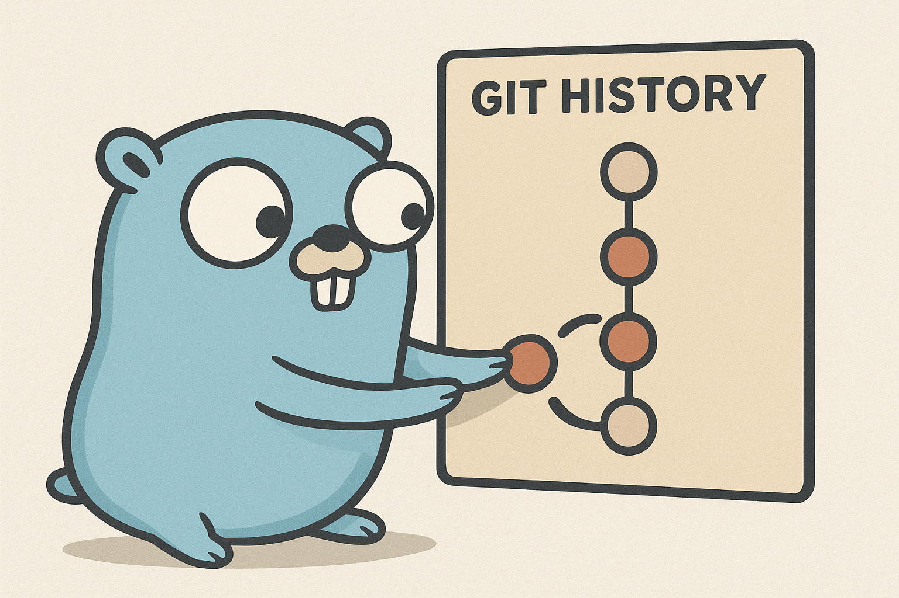

# Gommit - AI-powered Git companion


<p align="center">
  
</p>

Gommit is a command-line tool that leverages AI to automate your Git workflow. It generates intelligent commit messages, creates comprehensive PR descriptions, and helps you write better documentation for your code changes.

## 🎖️ Features

- 🤖 **AI-Agnostic:** Integrates with OpenAI, Anthropic, and other providers
- 💬 **Smart Commit Messages:** Analyzes your staged changes and suggests meaningful commits
- 📋 **PR Description Generation:** Automatically creates detailed PR descriptions from branch differences
- 📝 **PR Review Generation:** Automatically creates detailed PR review from branch differences
- 🎯 **Template Support:** Customize output with markdown templates
- 🔒 **Secure:** API keys are stored locally and masked in output
- 🏎️ **Fast:** Works directly with Git operations for quick analysis

## 🚀 Installation

**Quick Install**

```bash
go install github.com/alexandrocuma/gommit@latest
```

**Build from Source**

```bash
git clone https://github.com/alexandrocuma/gommit.git
cd gommit
go build -o gommit main.go
sudo mv gommit /usr/local/bin/
```

## ⚡️ Quick Start

**Initialize Configuration**

Run the interactive setup wizard to configure your AI provider:

```bash
gommit init
```

This will guide you through:

- Selecting an AI provider (OpenAI, Anthropic, etc.)
- Entering your API key
- Choosing a model
- Configuring generation parameters

## 🧩 Command Reference

| Command Name    | Description                                                |
| --------------- | ---------------------------------------------------------- |
| `gommit init`   | Initialize your Gommit configuration interactively.source. |
| `gommit`        | Generate commit message from branch diffs.                 |
| `gommit draft`  | Generate PR description from branch diffs.                 |
| `gommit review` | Generate PR review from branch diffs.                      |
| `gommit config` | Visualize the configuration stored in the file             |

## ⚙️ Configuration

**Configuration is stored in:**

- **Linux/macOS:** `~/.config/gommit/config.yaml`
- **Windows:** `%APPDATA%\gommit\config.yaml`

**Example configuration:**

```yaml
ai:
  provider: openai
  model: gpt-4o-mini
  temperature: 0.7
  max_tokens: 2048
  api_key: sk-...your-key-here
```

## 📁 Project Structure

```bash
.
├── cmd/           # CLI commands
├── internal/      # AI provider, Configurations, Git integrations
├── pkg/           # shared packages for integrations
├── main.go        # Entry point
└── README.md      # This file
```

## 🤝 Contributing

Contributions are welcome! Please feel free to submit a Pull Request.
